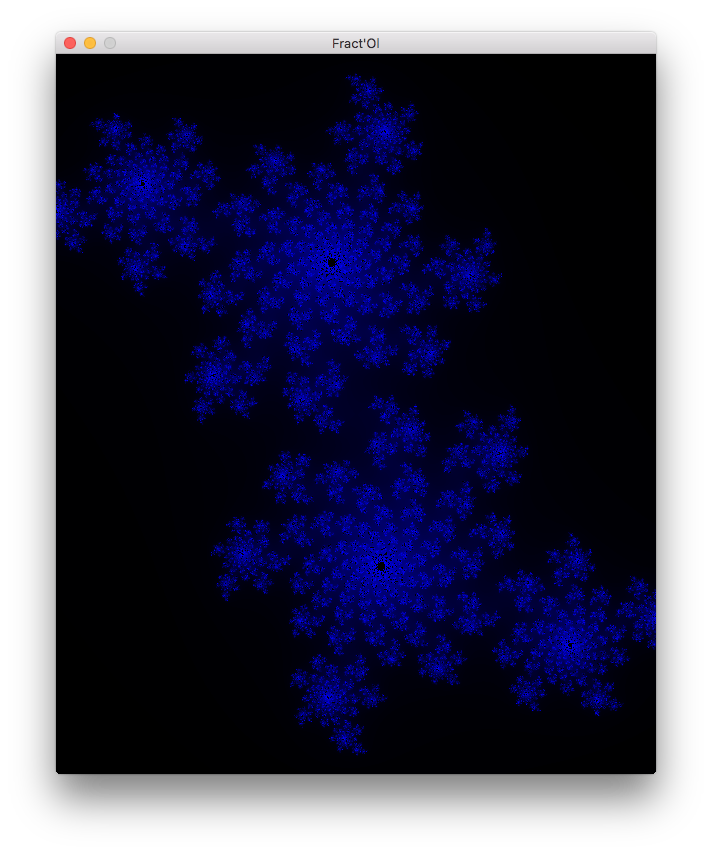
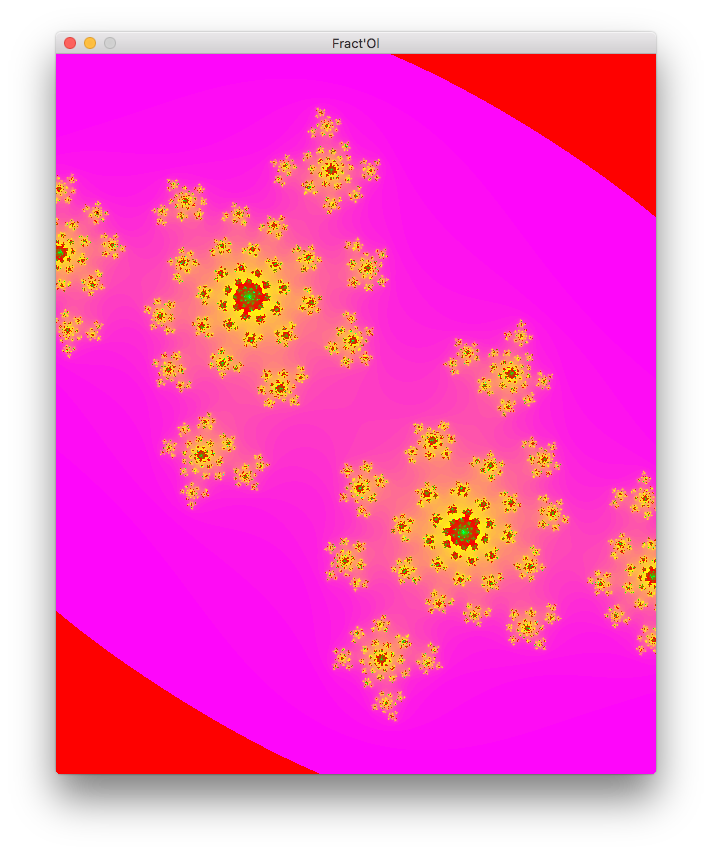

## Synopsis

**NOTE : It won't compile until you uses MacOS system**

This program is a fractal visualizer. It uses the *"minilibx"* which is a graphical library furnished by the 42 staff, and the *"libft"* which is a reimplementation of some of the lib C functions.

## Usage

./fractol [fractal name]

## How it works

Just build the program, using the makefile, then start it with one of the three fractal names implemented : julia, mandelbrot, burningship.

You could **move around** the fractal when it is zoomed, using the *numeric keys* but the 5. You could also **zoom** using the *+* and *-* key from the numeric keyboard, or using the *mouse wheel* as well. The zoom will follow (more or less) the mouse in the window.

You could also switch betzeen the two **color modes** using the *c* key.

Finally, to **exit the program**, you could just press the *esc* key, or click the red cross on top left corner of the window.

Note that the **julia fractal** will change according to the cursor position in the window !

## Screenshots

